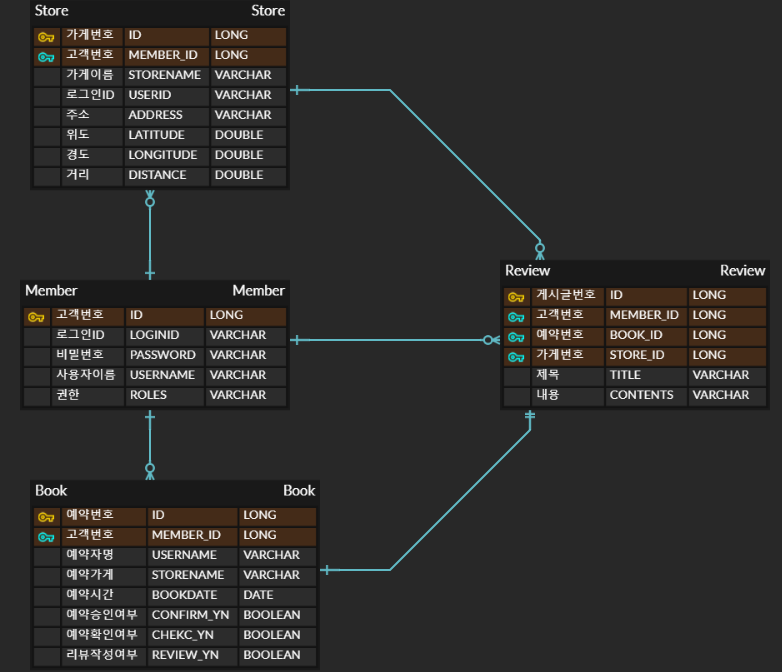

# kiosk-system

#프로젝트 소개

## 1.개요
웹/모바일을 통해 매장 관리 및 예약 서비스

[요구사항]
1. 공통 인증 구현
2. 매장의 관리인(점장)은 예약 서비스 앱에 상점을 등록(매장 명, 상점 위치, 상점 설명)
3. 매장 등록하기 위해서는 파트너 회원 가입이 되어야한다(가입을 통해 권한을 얻는 형식)
4. 매장 이용자는 앱을 통해 매장을 검색하고 상세 정보를 확인
5. 이용자의 위치 정보를 기준으로 가까운 매장 순서대로 검색 가능
6. 매장 상세 정보를 보고, 예약을 진행(예약을 진행하기 위해서는 회원 가입이 필수)
7. 서비스를 통해 예약한 이후, 예약 10분전에 도착하여 키오스크를 통해 방문 확인을 진행
8. 예약 및 사용 이후에 리뷰를 작성

# 개발 환경
- JDK 11.0.19
- IDE : Intellij
- Framework : SpringBoot(2.7.14)
- Database : MySql(8.0 / JPA) / Redis
- Tools : IntelliJ, Docker
- API's : Mailgun

# ERD

# 기능 구현

## 공통
- [x] 이메일을 통해서 인증번호를 통합 회원가입

### 회원/셀러
- [x] 회원 가입
- [x] 인증 ( 이메일 )
- [x] 로그인 토큰 발행
- [x] 로그인 토큰을 통한 제어( Role을 부여하여 기능 제한 )

## 주문 서버

### 관리인
- [x] 가게 등록
- [x] 본인 등록 매장 조회
- [x] 가게별 요일에 따른 예약 리스트 조회
- [x] 예약 수락

### 이용자
- [x] 가게 검색
- [x] 이용자 위치 기준 가게 거리 제공
- [x] 예약 추가
- [x] 유저별 예약 리스트 조회
- [x] 유저 예약 확인 -> 예약 시간 10분 전에 가능
- [x] 예약 리뷰 작성

